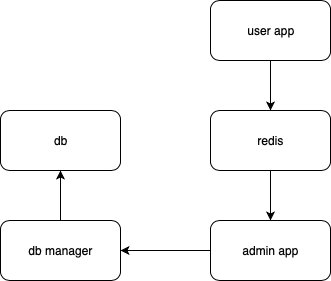

# Proiect-IDP
Popa Andrei-Marius, 341C3

-user app - aplicatie Python in care utilizatorii pot sa isi rezerve o masa la unul din restaurantele din baza de date;
-db manager - aplicateie care face operatii CRUD asupra bazei de date;
-admin app - aplicatie prin care proprietarii restaurantelor pot acepta cererile de rezervare din partea utilizatorilor;
-db - baza de date mySql care salveaza programul de rezervarii al fiecarei restaurant;
-redis - baza de date care mentine o coada cu cererile de rezervare;

